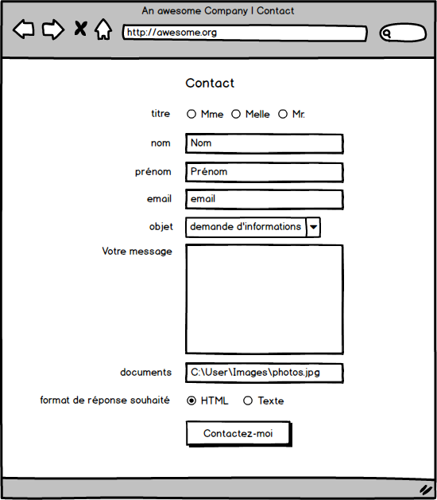

# Projet : Fil Rouge "Multipage Website"

- Durée : 7 jours ouvrables
- par groupe de 2 (inter-startup)
- Repository GitHub intitulé `multipage-website-in-php`
- Publier (gratuitement) l'application sur Heroku ([heroku](https://www.heroku.com))

## Demande client : Un site multipage avec un formulaire de contact fonctionnel

"J'ai besoin de rafraîchir mon site internet. J'aurais besoin d'un site avec plusieurs pages pour bien séparer le contenu."

"J'aimerais bien que les visiteurs de mon site puissent m'envoyer un mail via un formulaire de contact avec une petite photo."

## Modalités de remise

Vous recevrez un formulaire Google qui vous demandera 2 URL :

1. URL du repos intitulé exactement `multipage-website-in-php` :  
	- dispose de 3 branches (la branche master + 1 par membre du team)
	- le readme du repos :  
		- identifie qui / quoi / quand / comment,
		- contient un lien vers ce briefing ou un bref résumé de la demande initiale
		- contient au moins une capture d'écran de l'application.
		- Indique le score obtenu au [Lighthouse Test](https://developers.google.com/web/tools/lighthouse/)
	- Utilisez le "[projects Board](https://liftux.com/using-github-issues-project-management/)" du repo pour la gestion et le suivi des tâches

2. URL du site déployé en production sur Heroku

## Cahier des charges

Vous devez livrer un site multi-pages 

- qui respecte le principe [DRY](https://fr.wikipedia.org/wiki/Ne_vous_r%C3%A9p%C3%A9tez_pas) : tout élément d'interface qui se répète sera isolé dans un fichier "partiel" inclus dans le fichier gérant la requête, grâce à la fonction php `include()`
- qui sépare le calcul de l'affichage (le PHP à sa place et le HTML à la sienne, on ne mélange pas tout).
- de minimum 3 pages, maximum 5 pages (choisissez bien et gérez bien le contenu : concision, clarté, pertinence par rapport aux publics-cible et aux objectifs du client)
- Une de ces pages contiendra un formulaire de contact (méthode `POST`) avec la possibilité pour l'internaute de choisir son genre, l'objet de son message et s'il souhaite recevoir une réponse sous format HTML ou txt. (Vois ci-dessous le mockup de formulaire, pour t'inspirer)
- obligation d'utiliser un `.gitignore` (pour ne pas publier vos informations de connexion gmail sur GitHub)
- formulaire d'upload en HTML sémantique
	- envoi d'une image via cette classe externe [php upload](https://github.com/verot/class.upload.php)
	- la fonction `mail()` de php étant trop basique, utilise une [class externe pour mail](https://github.com/PHPMailer/PHPMailer)
	- toujours pour l'envoi de l'email, utilise un serveur SMTP gratuit comme gmail (utilisez votre propre compte)
	- Sanitisation : éviter les injections SQL
	- Validation : 
		- limiter l'upload uniquement aux formats d'images les plus courants (jpg, jpeg, png, gif)
		- obliger le minimum pour pouvoir répondre : email  + message
	- à chaque envoi du formulaire : 
		- bien respecter la séquence sanitiser > valider > exécuter > afficher (relire [ceci](https://github.com/becodeorg/lovelace-2/blob/master/Parcours/06-PHP/php-formulaires.md#backend--traitement-du-formulaire))
		- loguer l'activité dans un fichier texte qui sera mis à jour à chaque fois.
		- envoi des données du formulaire dans vos boîtes mail, avec CC à l'émetteur (l'utilisateur)
	- Mentionner le prénom, le nom, l'adresse mail, la date et l'heure et le format de réponse demandé par l'utilisateur.
	- faire une page supplémentaire (`/form-logs.php`) qui affiche le contenu du log sans mentionner les noms de famille, ni les adresses mails.
	- Lorsque l'utilisateur fait des erreurs d'encodage, les messages d'erreur s'affichent à proximité du champs concerné et sont pertinents
- CSS Responsive sur base d'un framework CSS au choix. 
- Score d'au moins 80/100 de chaque page au [Lighthouse Test](https://developers.google.com/web/tools/lighthouse/).

### Mockup du formulaire

## Pour commencer...

L'objectif de ce challenge est de vous donner l'occasion d'utiliser vos nouveaux acquis en PHP dans un scénario réaliste. Le projet est conséquent et introduit de nombreux problèmes intéressants pour votre apprentissage. Il est donc plus important pour nous que chaque membre de l'équipe atteigne ses objectifs d'apprentissage que de réussir le projet.

Par conséquent, durant la première journée de travail, vous aurez l'opportunité de voir votre binôme et de définir et répartir les objectifs d'apprentissage de chacun(e). Vous aurez jusque 12h30 pour vous voir. Après ce moment-là, chacun dans sa start-up, vous devrez travailler à distance, via Ryver et GitHub. Pas de négociation ou d'exception possible.

**Comment vous organiser ?**

- Etude de la demande :  
	- As-tu tout compris ? Pour le savoir, reformule la demande avec ton/ta collègue et comparez votre compréhension mutuelle.
	- Réalisez un prototype papier, puis balsamiq/invision.com/AdobeXD, des écrans à construire.
	- Clarifie pour toi-même ce que doit faire chacune des composantes de ton application, via de l'Unified Modelling Language (UML) ([example 1](http://astah.net/features/uml-features/uml-features-class.png), [example 2](http://msoe.us/taylor/tutorial/se1021/exceptionUML.png)). Un outil utile pour pseudo-coder : https://code2flow.com 
- Discutez ensemble, en laissant à chacun(e) l'opportunité d'exprimer ce qui l'intéresse dans ce projet en terme d'objectifs d'apprentissage. --> Voir Animation des "petits papiers" et la "Liste des OA".
- Créez le repository sur GitHub 
- Désignez un(e) coordinateur/trice du projet, qui tiendra à jour le Project Board et qui sera aussi le lieutenant du repo.
- Identifiez les tâches
- Répartissez-vous les rôles (backend/frontend) et les tâches
- Créez une colonne "Todo", "Doing", "To merge", "Done"
- Convenez des étapes de création du projet
- La suite ?  À vous de vous organiser...

## Teamwork mode !
Entraidez-vous. Communiquez, vérifiez, critiquez de manière constructive. Lorsque vous communiquez, n'oubliez pas les [principes de la communication non violente](https://github.com/becodeorg/BeCode/wiki/CNV-:-Communication-non-violente). Ne codez jamais à la place de l'autre, mais guidez-le par des questions.
Si vous avez un pépin, mettez votre fierté de côté et communiquez simplement à l'équipe en étant le plus précis possible dans votre demande.

## Animation des "petits papiers"
(copyright Bertrand)

Recopiez sur des petits papiers chacun de ces objectifs d'apprentissage parmi la liste ci-dessous, puis répartissez-les entre vous en fonction de vos objectifs d'apprentissage personnel dans ce projet.
Lorsque un objectif d'apprentissage est souhaité par plusieurs personnes, mettez-le de côté, pour y revenir une fois que ceux qui ne font pas discussion aient d'abord été distribués. Discutez alors ensemble, à la limite mettez-vous d'accord pour par exemple, travailler ensemble sur ce point particulier, ou par exemple que la personne qui l'obtient fasse un petit cours à l'autre pour lui montrer.

Au final, faites en sorte que les choses soient réparties de manière équilibrée et que tout le monde aie une part équivalente d'objectifs et de charge de travail.

Le/a coordinateur/trice du projet ajoute quels objectifs sont portés par quel membre de la team dans le Readme.

### Liste des objectifs d'apprentissage (OA)

*Grâce à ce projet, je voudrais apprendre (choisis environ 6 ou 7 OA) :*

1. **groupe : Agile (manipulation tableau kanban) + tenue quotidienne du planning du groupe**  
Évaluation : présence d'un _projects board_ bien tenu et montrant qu'il a été utilisé pour la gestion du projet.

1. **groupe : être le capitaine du repos, qui gère les merge et les conflits**  
Évaluation : conflits résolus, présence de branches sur lesquelles chacun(e) a travaillé...

1. **groupe : rédaction d'un readme complet et professionnel**  
Évaluation : fichier readme bien construit et contenant un lien vers le projet en ligne.

1. **UX : branding**  
Évaluation : le site fournit représente un outil marketing perçu comme professionnel. Un système graphique cohérent se retrouve de pages en pages.

1. **UX : contextual user entry errors display**  
Évaluation : lorsque j'introduis volontairement des erreurs dans le formulaire (maladress ou tentative d'injection SQL), le html du ou des messages d'erreurs s'affichent à proximité du champ concerné.

1. **UX : mentions GDPR et Copyright pour informer l'utilisateur de l'utilité de fournir les données**  
	Évaluation :  

	- une option non cochée par défaut dans le formulaire permet à l'utilisateur de spécifier qu'il est d'accord que le site utilise ses données et documents envoyés uniquement afin de répondre à sa requête directe et non à des fins de marketing ou autre.
	- une notification invite l'utilisateur à accepter l'usage de cookies.
	- toute image sera accompagnée d'une légende à proximité, indiquant l'auteur (et la source si disponible).

1. **frontend : sélection et mise en place d'un framework CSS**  
Évaluation : un framework CSS a été utilisé pour réaliser les interfaces.

1. **backend : UML charting des différents scripts**  
Évaluation : présence dans le readme de l' UML du script traitant le formulaire.

1. **backend : upload d'image**  
Évaluation : lorsque l'on soumet le formulaire, l'image est bien uploadée et est présente dans l'email au format HTML.

1. **backend : édition d'un fichier txt en PHP**  
Évaluation : lorsque l'on soumet le formulaire, une nouvelle ligne s'ajoute au fichier de Log.

1. **backend : utilisation d'un serveur SMTP**  
Évaluation : un email envoyé est bien reçu. Dans le code, utilisation d'un serveur SMTP externe.

1. **backend : éviter les injections SQL**  
Évaluation : le script php traitant le formulaire empêche l'injection SQL d'être potentiellement exécutée.

1. **devops : déploiement sur Heroku**  
Évaluation : le site de production fonctionne sans bugs sur Heroku.

1. **backend : afficher les erreurs à proximité des champs concernés**  
Évaluation : lorsque j'introduis volontairement des erreurs dans le formulaire (maladress ou tentative d'injection SQL), le html du ou des messages d'erreurs s'affiche à proximité du champ concerné.

1. **frontend/backend : utiliser le [lighthouse test](https://developers.google.com/web/tools/lighthouse/) pour améliorer son site et atteint un score de minimum 80 pour chaque critère.**  
Évaluation : chaque page du site sera testée.

1. **frontend : Progressive Web App**  
Évaluation : le score de l'aspect PWA de Lighthouse Test sera de 100.

## Les groupes et les projets

| Johnson | Lovelace | Projet  |
|--:|:--|:--:|
|Colombe Sechehaye|	Geoffrey Poelmans| http://users.skynet.be/foret/index.html |
|Nicolas de Liedekerke|	Guillaume Bare|http://www.assoc.be/ |
|Merieme Lamri|	Anthony Sel| http://www.lespetitsvieux.be/ |
|Nathan Houtain|	Romain Vandevoorde| https://solidarite-savoir.be/ |
|Liam Carlier|	Mostapha Tahri| http://bienvivrechezsoi.be/ |
|Guillaume Kreit|	Michael Debus, Pedro Seromenho| http://convivial.be/ |
|Ajay Shinde|	Morgane  Meganck| http://www.intergeneration.be/ |
|Alexandre Infanti	|Julie Connerotte| https://petitsriens.be/ |
|Antoni Dalle Nogare|	Baptiste Firket|http://www.loupiote.be/ |
|Marco Bove|	Mohamed Ali Nadir| https://sites.google.com/site/repaircafeschaerbeek/ |
|Marie Louise Ogdoc|	Mariane Niwemfura| http://www.abpasbl.be/-AMV-asbl-Bruxelles- |
|Massimo Regaglia|	Andrea Pinna| http://www.centreculturelwanze.be/ |
|Hakan Poyraz	|Stéphane Wyns| http://www.tele-accueil-bruxelles.be/ |
|Jean-François Geerinckx|	Paul Henrot| http://www.assoc.be/ |
|Jesse Fumba	|Sourech Bauts|https://www.nph-belgium.org/ |
|Charlotte Tusset|	Liliane Mamale| http://www.chomhier.be |
|Cedric Fournier|	Meilyn Andrade|  http://www.senoah.be |
|Marie Cambie	|Ludovic Hautecoeur| http://www.potage-toit.be/ |
|Thibault Gribaumont|	Dylan Valente| https://www.lhiving.be/contact-fr/ |
|Eric Lavachery|	Claudiu Cornea| http://melius.be/fr/melius.php |
|Adrien d'Oreye|	Sammuel Jassens| http://www.entraide-marolles.be/ |
|Stephane Wilfort|	Quang Le| https://www.letilt.be/ |
|Guillaume Deruwez	|Gaetano Mico Latorre| https://sites.google.com/a/ballonrouge.be/www/ |
|Geraldine Winand	|Ludovic Dhoore| http://endobelgique.be/|
